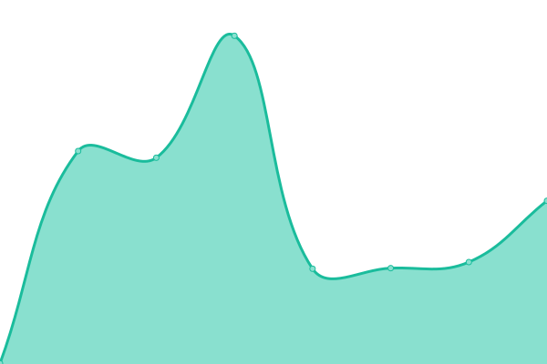

# [📈 Live Status](https://ajwarnick.github.io/monitor): <!--live status--> **🟩 All systems operational**

This repository contains the open-source uptime monitor and status page for [Anthony Warnick](http://anthonywarnick.com/), powered by [Upptime](https://github.com/upptime/upptime).

With [Upptime](https://upptime.js.org), you can get your own unlimited and free uptime monitor and status page, powered entirely by a GitHub repository. We use [Issues](https://github.com/ajwarnick/monitor/issues) as incident reports, [Actions](https://github.com/ajwarnick/monitor/actions) as uptime monitors, and [Pages](https://ajwarnick.github.io/monitor) for the status page.

<!--start: status pages-->
<!-- This summary is generated by Upptime (https://github.com/upptime/upptime) -->
<!-- Do not edit this manually, your changes will be overwritten -->
<!-- prettier-ignore -->
| URL | Status | History | Response Time | Uptime |
| --- | ------ | ------- | ------------- | ------ |
|  [Main Domain](https://www.anthonywarnick.com) | 🟩 Up | [main-domain.yml](https://github.com/ajwarnick/monitor/commits/HEAD/history/main-domain.yml) | 

 315ms
     
 | 

<a href="https://ajwarnick.github.io/monitor/history/main-domain">99.69%</a>
    

|  [ZIP Code API](https://zipapi.vercel.app/api/66502) | 🟩 Up | [zip-code-api.yml](https://github.com/ajwarnick/monitor/commits/HEAD/history/zip-code-api.yml) | 

 1021ms
     
 | 

<a href="https://ajwarnick.github.io/monitor/history/zip-code-api">100.00%</a>
    

|  [Chu , Goodinng](https://chugooding.com/) | 🟩 Up | [chu-goodinng.yml](https://github.com/ajwarnick/monitor/commits/HEAD/history/chu-goodinng.yml) | 

 756ms
     
 | 

<a href="https://ajwarnick.github.io/monitor/history/chu-goodinng">99.16%</a>
    

|  [David Petersen Gallery](https://davidpetersengallery.com/) | 🟩 Up | [david-petersen-gallery.yml](https://github.com/ajwarnick/monitor/commits/HEAD/history/david-petersen-gallery.yml) | 

 255ms
     
 | 

<a href="https://ajwarnick.github.io/monitor/history/david-petersen-gallery">100.00%</a>
    

|  [Danni O'Brien Shop](https://shop.danniobrien.com/) | 🟩 Up | [danni-o-brien-shop.yml](https://github.com/ajwarnick/monitor/commits/HEAD/history/danni-o-brien-shop.yml) | 

 656ms
     
 | 

<a href="https://ajwarnick.github.io/monitor/history/danni-o-brien-shop">100.00%</a>
    

|  Media Server | 🟩 Up | [media-server.yml](https://github.com/ajwarnick/monitor/commits/HEAD/history/media-server.yml) | 

 419ms
     
 | 

<a href="https://ajwarnick.github.io/monitor/history/media-server">100.00%</a>
    

<!--end: status pages-->

[**Visit our status website →**](https://ajwarnick.github.io/monitor)

## 📄 License

- Powered by: [Upptime](https://github.com/upptime/upptime)
- Code: [MIT](./LICENSE) © [Anthony Warnick](http://anthonywarnick.com/)
- Data in the `./history` directory: [Open Database License](https://opendatacommons.org/licenses/odbl/1-0/)
